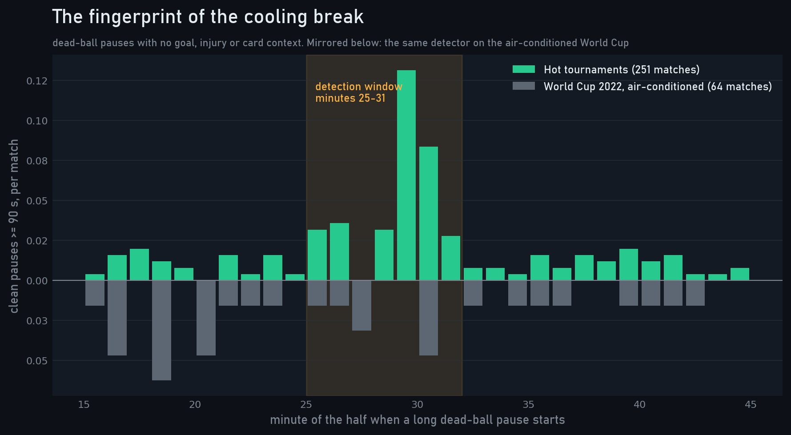
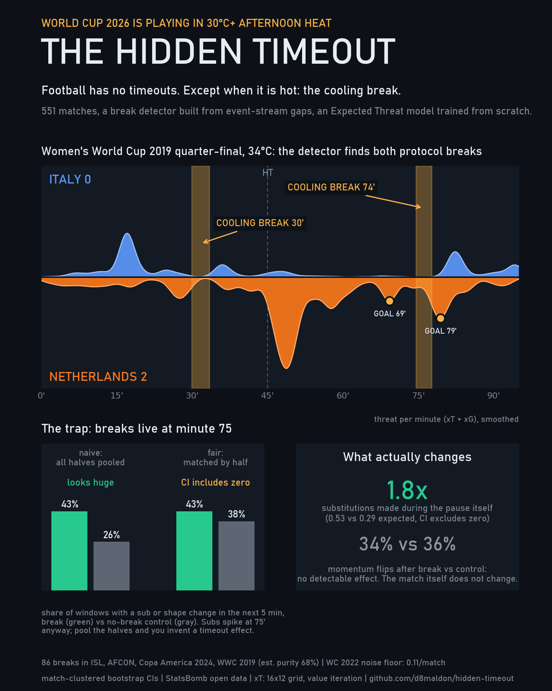
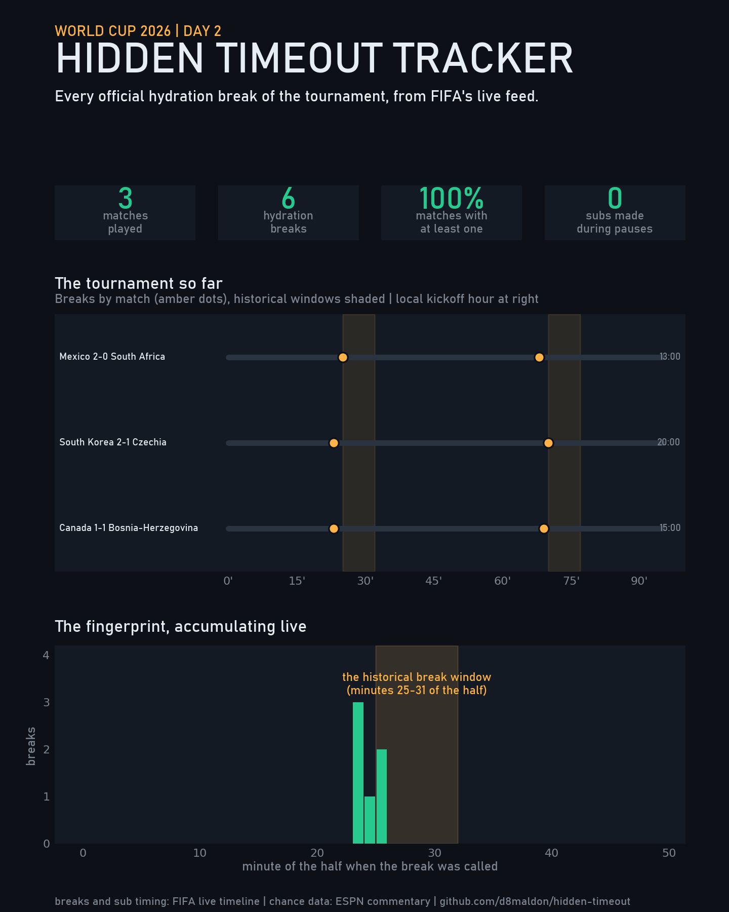
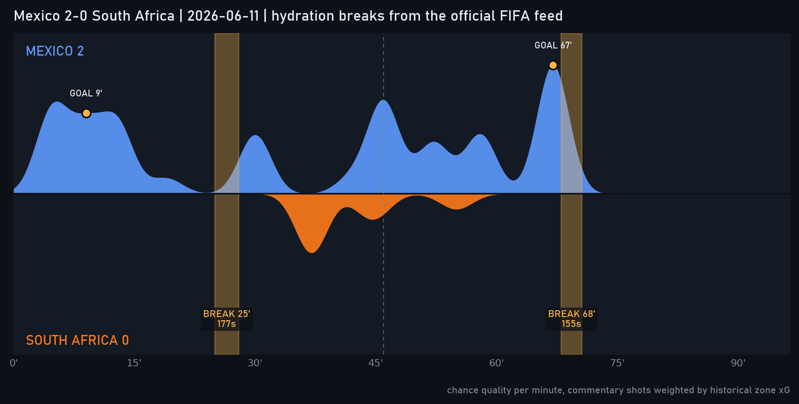
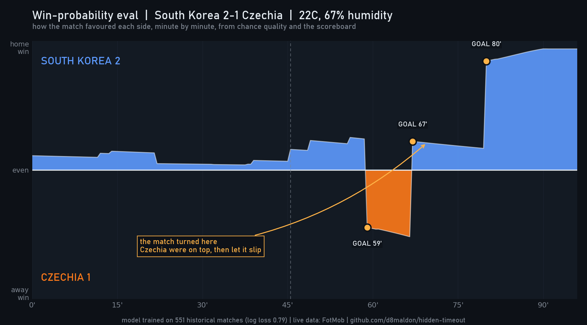
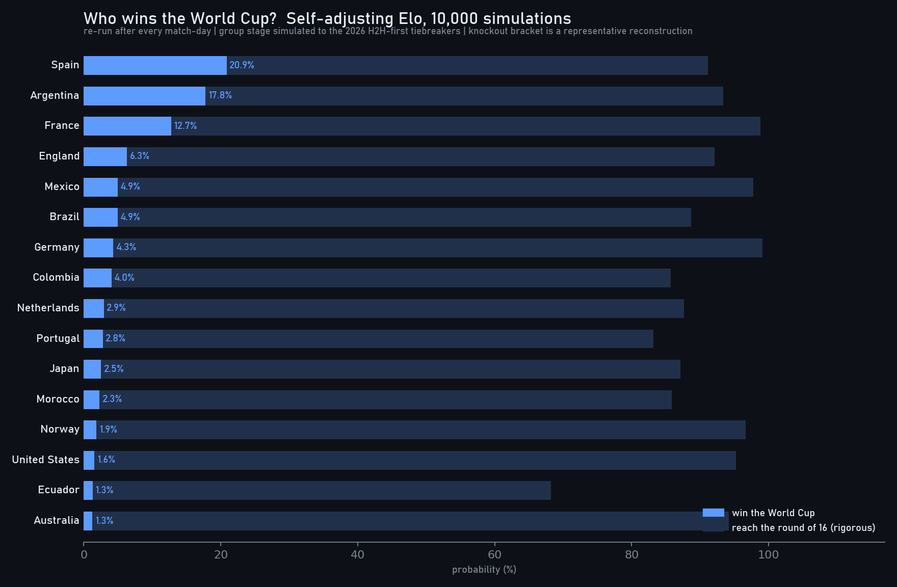
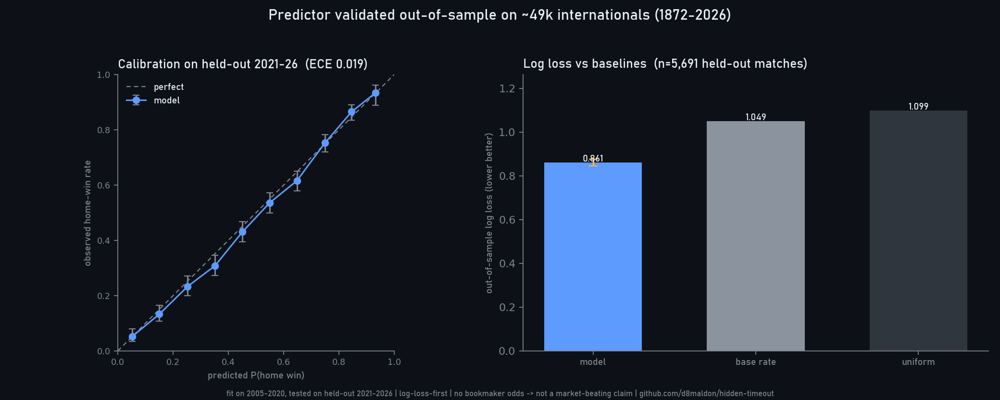
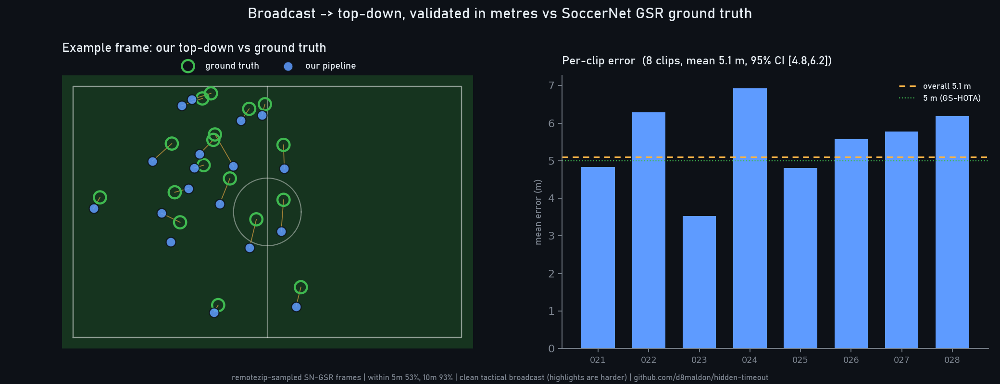
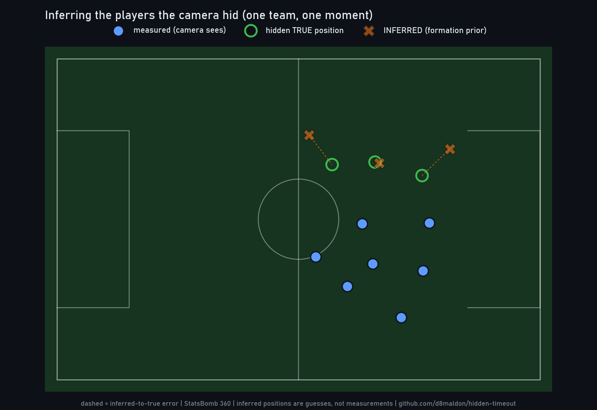
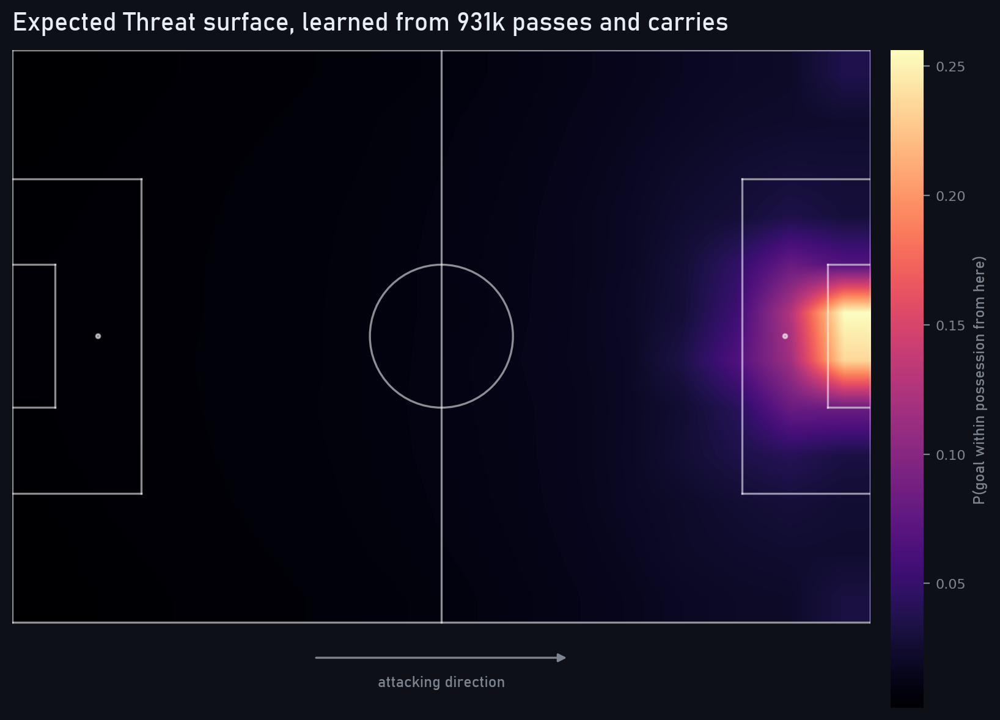

# futbol_tech

World Cup 2026 football analytics: a cooling-break study, a validated match
predictor, and broadcast computer vision. (Originally "hidden-timeout", after
the cooling-break finding below.)

Football has no timeouts. Except since 2014 it quietly does: when it is hot
enough, the referee stops play around minute 30 of each half for a cooling or
drinks break, and both benches get a mid-half conversation with the whole
team. This repo detects those breaks in free StatsBomb event data and
measures what they actually change.

Built while the 2026 World Cup, played in 30C+ North American summer
afternoons, kicks off.

## Finding the breaks

No public dataset labels cooling breaks. But they leave a fingerprint: a
dead-ball gap of 90 seconds or more, starting around minute 25-31 of either
half, with no goal, injury or card to explain it.



Detector firings per match, by tournament:

| tournament              | firings/match | reading                    |
|-------------------------|---------------|----------------------------|
| ISL 2021/22 (India)     | 0.43          | breaks in most matches     |
| Copa America 2024 (USA) | 0.28          | hot-venue matches          |
| AFCON 2023 (Ivory Coast)| 0.29          | hot-venue matches          |
| WWC 2019 (France)       | 0.23          | heatwave weeks             |
| Euro 2024               | 0.14          | ~ background               |
| Euro 2020               | 0.12          | ~ background               |
| WC 2018 (Russia)        | 0.09          | ~ background               |
| WC 2022 (Qatar, AC)     | 0.11          | the measured noise floor   |
| WWC 2023 (winter)       | 0.08          | ~ background               |

The air-conditioned 2022 World Cup defines the false-positive floor: 0.11
firings per match (VAR checks, slow restarts). Hot tournaments run 2-4x that,
and only those four enter the break set: 86 breaks, estimated 68% genuine.

Validation against ground truth: the WWC 2019 quarter-final (Italy 0-2
Netherlands, 34C in Valenciennes) was reported at the time as requiring
cooling breaks. The detector, knowing nothing but event timestamps, finds
both: minute 29.9 of the first half and 74.5 of the match, right where the
FIFA protocol puts them.



## World Cup 2026, live

StatsBomb-grade event streams for this tournament will not be public for
years, but two live feeds cover the analysis:

- FIFA's timeline API logs every hydration break officially (event type 83,
  "Match paused for a hydration break") and the resume (type 78), both with
  millisecond wall clocks, so break durations and subs-made-during-the-pause
  are exact, not inferred.
- ESPN's commentary describes every shot with a location phrase ("centre of
  the box", "very close range"). Those zones are calibrated against the
  13.6k open-play shots in the historical data (very close range 0.29,
  centre of box 0.13, outside 0.035, 35+ yards 0.007) to weight each chance,
  which is enough to draw the momentum rivers for live matches.

`src/wc2026.py` pulls every finished match, writes small CSVs to `wc2026/`,
and regenerates the tracker plus one river per match:



Through day 5: twelve matches, twenty-four official breaks, one in each half
of every match including 8pm kickoffs, all called around minutes 23-25 of the
half (median 23', a few minutes earlier than the historical norm) and running
about three minutes each. Six substitutions have been made during the pauses
so far, all of them in two matches. The opener:



```
python src/wc2026.py
```

### Live win-probability eval (the chess-engine view)

`src/winprob.py` trains an in-game win-probability model on the 551
historical matches: multinomial logistic regression on goal difference,
cumulative xG difference, red-card man advantage and time remaining,
predicting P(home win / draw / away win). Out-of-sample on a match-grouped
holdout it scores log loss 0.82, after taming the raw logit's over-confidence
with a temperature scaling (T=1.25) and adding a lead-by-time-remaining
interaction; the coefficients and temperature are saved as plain JSON so scoring
needs only numpy.

`src/live_eval.py` drives it from FotMob's per-shot xG and event feed to
draw a chess.com-style evaluation bar for each match: one line, up means
the home side is favoured to win, down the away side, zero a coin flip. It
moves on goals, red cards and the slow drip of chance quality, and the
single biggest swing is annotated the way an engine flags the losing move,
with the narrative chosen from what actually happened (a collapse is called
a collapse, a comeback a comeback).



Czechia led 1-0 from the 59th minute and the eval crossed into their half;
South Korea equalised at 67' and won it at 80'. The model reads the
turning point as the equalizer, not the winner. Per-match swings are
written to `wc2026/winprob_swings.csv`.

```
python src/live_eval.py            # every finished match so far
python src/live_eval.py 4667757    # a single FotMob match id
```

## The trap: breaks live at minute 75

The naive analysis is seductive. Pool everything and you get: 43% of breaks
are followed by a substitution or formation change within 5 minutes, against
26% in no-break control windows. Substitutions during the pause run almost 3x
the pooled control rate. It looks like coaches treat the pause as a free timeout.

It is mostly composition. Second-half breaks sit at minute 75, which is
prime substitution time with or without a break, and the break set is 62%
second halves while the control set is 61% first halves. Comparing like
halves with like:

- sub or shape change within 5 min: 43% vs 38% (control standardized to the
  break period mix), 95% CI on the gap -5 to +15 points. Not significant.
- second half only, match-clustered: 68% vs 57%, CI -4 to +27 points.
- first half only: 3% vs 7%. Nothing.

## What survives

- Substitutions migrate into the pause itself. 0.53 subs are made during the
  average break against 0.29 expected (period-standardized), roughly 1.8x, CI
  +0.04 to +0.46. Coaches use the dead time to make the changes they were
  about to make anyway. (Read with care: control halves cannot contain long
  sub stoppages by construction, and some detected breaks are themselves
  substitution stoppages, so part of this gap is selection.)
- Momentum does not detectably move. The team dominating threat (xT + xG)
  before the break stays dominant after it as often as in control windows:
  flips 34% vs 36%, CI -14 to +10 points; mean swing in threat share is
  indistinguishable. With 68% purity this is low-powered against subtle
  effects, so it is a no-detectable-effect result, not proof of absence.
- Formation changes during the pause: no detectable excess (CI -11 to +2
  points).

## Predicting the matches and the champion

`src/ratings.py` rates every nation with self-adjusting World Football Elo,
seeded by replaying the full international record (~49k matches, 1872-2026, the
martj42 dataset) up to kickoff and updated one step per finished game -- the
very engine validated out-of-sample below, so every nation, debutants included,
carries an earned rating instead of a flat prior. Elo emits only a win
expectancy, so the rating gap is mapped to P(win / draw / away) with a Davidson
draw model that auto-upgrades to a multinomial logit, reusing the same softmax +
JSON contract as `winprob`.

`src/montecarlo.py` simulates the rest of the tournament 10,000 times: the
remaining group games (Poisson scorelines drawn from the rating gap), the
2026 head-to-head-first group tiebreakers, and the knockout bracket, tallying
each nation's title probability.



`src/backtest.py` scores the games already played, leakage-free (each pick uses
only pre-kickoff results); `src/goalscorer.py` gives anytime-goalscorer odds and
`src/action_value.py` values every pass and carry by the Expected Threat it adds
(the event-data analogue of NBA Expected Possession Value).

The schedule and results behind all of this come from FIFA's calendar via
`src/fixtures.py` -- all 104 matches, played and upcoming, the data layer the
simulator and the backtest share -- and `src/squads.py` pulls the 48 confirmed
squads from FotMob so the goalscorer and action-value boards list only players
actually at the tournament. `src/goal_hazard.py` adds the historical
goal-hazard curve (when goals arrive, stoppage-time spikes and all) alongside a
deliberately-labelled-weak live danger model (AUC ~0.55).

### Is it any good? Out-of-sample validation

A dozen World Cup games is far too few to claim anything, so `src/backtest_history.py`
replays ~49,000 men's internationals (1872-2026, the public martj42 dataset)
through the same Elo engine, fits the draw model on 2005-2020 and scores the
**held-out 2021-2026** (5,691 matches it never saw):



Out-of-sample log loss **0.86** (95% CI 0.85-0.88) against 1.05 for the base
rate and 1.10 for uniform, with calibration **ECE 0.019**. Properly validated
and well calibrated. It is *not* a claim to beat the bookmakers: this dataset
carries no odds, and that is the honest ceiling.

## From the broadcast to a top-down map

No public tracking exists for this World Cup, so the positional layer is built
straight from video. `src/broadcast_track.py` detects players and the ball with
a soccer-tuned detector (so crowd and bench are never counted); `src/homography.py`
finds the pitch homography from a 32-keypoint model and warps each player onto
pitch coordinates; `src/track_fuse.py` follows them over time with a Kalman
filter and kit-colour ReID. `src/live_screen.py` runs the same pipeline live on a
screen region, a video file, or a phone used as a webcam pointed at a TV.

### Validated in metres

`src/validate_topdown.py` measures the top-down against SoccerNet Game State
Reconstruction ground truth (streamed with `remotezip`, no multi-GB download):



Mean localisation error **5.1 m** (95% CI 4.8-6.2), 53% within 5 m across eight
clips, around the GS-HOTA 5 m tolerance: heatmap-grade positioning of the
visible players.

What did **not** work, tested and reported as such: higher input resolution does
not help (`src/cv_compare.py` runs 480p against 1080p through the identical
pipeline -- the detector downscales internally, and a larger inference size
mostly finds crowd and degrades the homography); jersey-number reading is
hopeless at broadcast resolution; and off-screen players cannot be reconstructed
from a single frame -- `src/fuse_eval.py` hides the players farthest from the
ball and tries to put them back from a 4-3-3 formation prior, and the per-player
error in metres is large:



`src/board.py` fuses everything into one dossier per match -- the
win-probability eval, pre-match odds versus the result, the goal/card/sub
replay (`src/replay.py`), and the tactical snapshot (`src/tactical.py`:
kit-colour team assignment and convex-hull shape on the warped frame).
`src/pitch_control.py` and `src/minimap_track.py` are earlier exploratory
demos -- a pitch-control surface from a 360 freeze frame, and a feasibility
check for tracking off a broadcast minimap -- kept for reference, not part of
the live pipeline.

`src/visual_ai.py` runs that whole stack over an entire broadcast or highlights
reel and renders the "visual-AI" view in three synced panels: the broadcast with
team-coloured boxes, the top-down convex-hull team shapes, and a live
pitch-control probability map (which team owns each patch of grass), recomputed
every frame. It is built for a highlights montage -- scene cuts reset the tracker
and graphics/replays/close-ups blank honestly as "no pitch view" -- and uses
EMA-smoothed homography plus Kalman persistence so the top-down does not flicker.
The whole Argentina 3-0 Algeria extended highlights run is in
`figures/wc2026_argentina_clip.mp4` (a two-stage CV-then-render pipeline; the full
13-minute version renders locally).

## Method

1. `download.py`, `extract.py`: 551 matches, 10 tournaments, ~1.9M events
   from [StatsBomb open data](https://github.com/statsbomb/open-data) into
   compact CSVs: dead-ball gaps with context, substitutions and tactical
   shifts, moves and shots.
2. `xt_model.py`: Expected Threat from scratch. Markov reward process on a
   16x12 grid, transitions estimated from 931k move attempts (failed moves
   absorb to zero; shootout and penalty kicks excluded from the shot model),
   solved by value iteration. `winprob.py` adds the in-game win-probability
   model used by the live eval graphs.

   

3. `analyze.py`: classifies pauses, then compares break windows against
   pseudo-breaks placed at the median break minute in halves with no long
   mid-half pause. Both arms are measured identically (actions during the
   pause interval and in the 5 minutes after, threat in 10-minute windows
   before and after). Everything is reported per period and standardized to
   the break period mix; bootstrap CIs resample matches, not windows.

## Limitations

- The detector is statistical. Purity is ~68% in the break set (75% ISL,
  ~62% AFCON and Copa, ~53% WWC 2019), measured against the WC 2022 floor.
  Contamination shrinks true differences toward zero: conservative for the
  positive findings, but it also weakens the momentum null.
- Control halves are quieter than break halves by construction (no long
  stoppage of any kind mid-half), which biases tactical comparisons in
  favor of finding a break effect; the null survives anyway.
- Threat windows are 10 minutes; slower payoffs are invisible.
- Tournaments only, and heat co-varies with competition, squad depth and
  stakes. Period standardization removes the largest confound, not all.

## Reproduce

```
pip install -r requirements.txt
python src/download.py    # ~1.5 GB of event JSON
python src/extract.py
python src/xt_model.py
python src/analyze.py
python src/make_figures.py

# prediction
python src/fixtures.py           # pull the full FIFA schedule (played + upcoming)
python src/squads.py             # confirmed 48 squads, to filter the player boards
python src/winprob.py            # in-game win-probability model
python src/ratings.py            # self-adjusting Elo + draw model
python src/montecarlo.py         # champion probabilities
python src/backtest.py           # leakage-free backtest of the games played
python src/backtest_history.py   # out-of-sample validation on 49k internationals
python src/goalscorer.py         # anytime-goalscorer odds
python src/action_value.py       # Expected-Threat action values + possession ticker
python src/goal_hazard.py        # goal-hazard timing curve + live danger model

# live (FIFA / ESPN / FotMob feeds)
python src/wc2026.py             # the hidden-timeout break tracker + momentum rivers
python src/live_eval.py          # win-probability eval per match
python src/replay.py             # event-by-event match report per match
python src/board.py              # per-match analysis dossier

# shareable demo visuals
python src/highlights.py         # eval-bar board: the tournament's biggest win-prob swings
python src/chances.py            # xG chance map: every shot rated by goal probability
python src/tactical_clip.py      # animated broadcast -> top-down side-by-side (visible players)

# vision (computer-vision deps; weights pulled from HuggingFace)
python src/homography.py --frame <frame>     # broadcast -> top-down
python src/track_fuse.py --frames-dir <dir>  # temporal fusion tracker
python src/validate_topdown.py   # metres-accuracy vs SoccerNet GSR
python src/cv_compare.py         # 480p vs 1080p ablation (resolution is not the bottleneck)
python src/fuse_eval.py          # off-screen reconstruction benchmark (a negative result)
python src/tactical.py --frame <frame>       # kit-colour team shapes on one frame
python src/live_screen.py --camera 1 --show  # live, phone-as-webcam at a TV
```

## References

- StatsBomb open data, https://github.com/statsbomb/open-data
- K. Singh, Introducing Expected Threat, 2018,
  https://karun.in/blog/expected-threat.html
- FIFA cooling break protocol (introduced at the 2014 World Cup; WBGT
  threshold, breaks around 30' and 75')
- Heat and cooling breaks at the Italy-Netherlands WWC 2019 quarter-final:
  contemporary reports, e.g. The Globe and Mail, 2019-06-28
